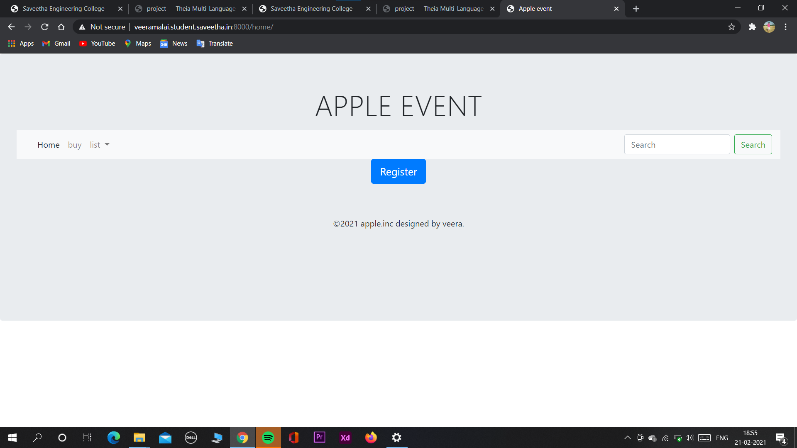
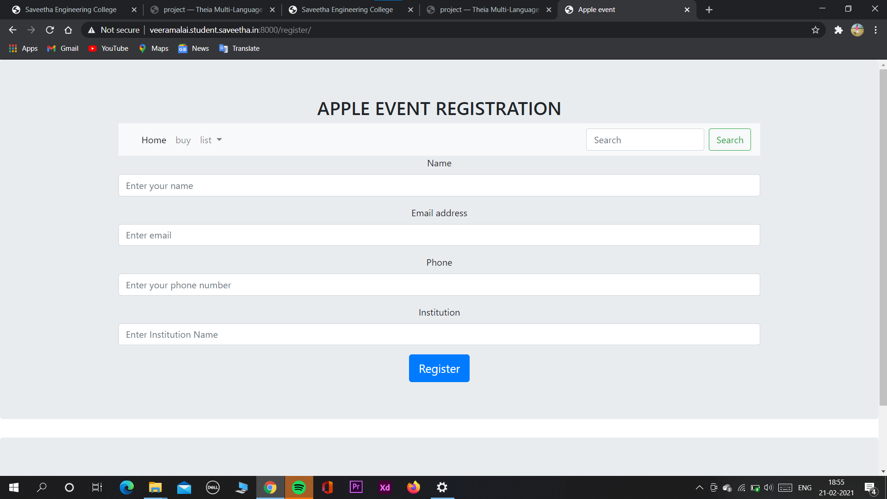
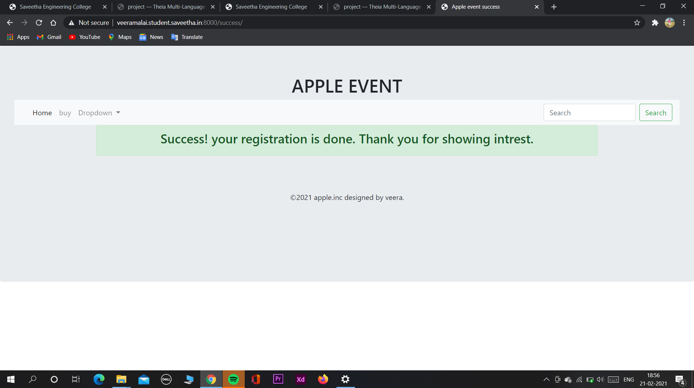
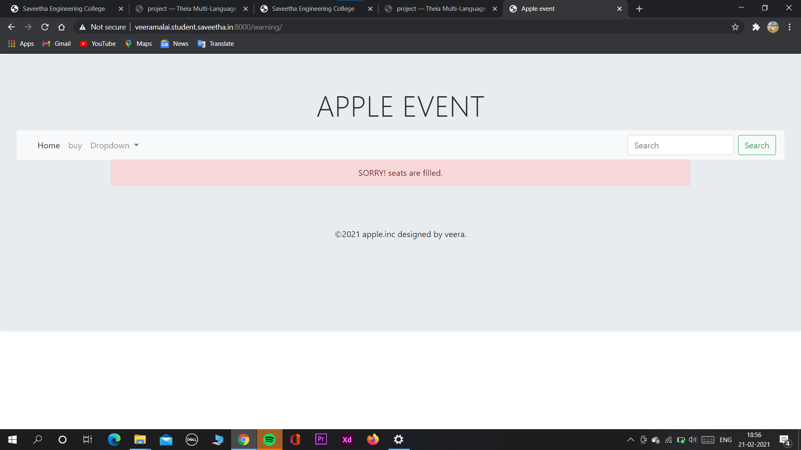

# WebApplication for Event Registration

## AIM:
To create a UX design and develop a web application for event registration.
## DESIGN STEPS:


## DESIGN SCREENS:


## WIREFRAME:


## PROTOTYPE:


## PROGRAM:
## home.html
```
<!doctype html>
<html lang="en">
  <head>
    <!-- Required meta tags -->
    <meta charset="utf-8">
    <meta name="viewport" content="width=device-width, initial-scale=1, shrink-to-fit=no">

    <!-- Bootstrap CSS -->
    <link rel="stylesheet" href="https://maxcdn.bootstrapcdn.com/bootstrap/4.0.0/css/bootstrap.min.css" integrity="sha384-Gn5384xqQ1aoWXA+058RXPxPg6fy4IWvTNh0E263XmFcJlSAwiGgFAW/dAiS6JXm" crossorigin="anonymous">

    <title>Apple event</title>
  </head>
  <body>
    <div class="jumbotron">
        <div class="container text-center">
                 <h1 class="display-4">APPLE EVENT</h1>
                </p>
            </div>
        <nav class="navbar navbar-expand-lg navbar-light bg-light">
  <a class="navbar-brand" href="#"></a>
  <button class="navbar-toggler" type="button" data-toggle="collapse" data-target="#navbarSupportedContent" aria-controls="navbarSupportedContent" aria-expanded="false" aria-label="Toggle navigation">
    <span class="navbar-toggler-icon"></span>
  </button>

  <div class="collapse navbar-collapse" id="navbarSupportedContent">
    <ul class="navbar-nav mr-auto">
      <li class="nav-item active">
        <a class="nav-link" href="#">Home <span class="sr-only">(current)</span></a>
      </li>
      <li class="nav-item">
        <a class="nav-link" href="https://www.apple.com/in/iphone/">buy</a>
      </li>
      <li class="nav-item dropdown">
        <a class="nav-link dropdown-toggle" href="#" id="navbarDropdown" role="button" data-toggle="dropdown" aria-haspopup="true" aria-expanded="false">
          list
        </a>
        <div class="dropdown-menu" aria-labelledby="navbarDropdown">
          <a class="dropdown-item" href="/listofparticipants">participants</a>
          <a class="dropdown-item" href="#">Another action</a>
          <div class="dropdown-divider"></div>
          <a class="dropdown-item" href="#">Something else here</a>
        </div>
      </li>
      
    </ul>
    <form class="form-inline my-2 my-lg-0">
      <input class="form-control mr-sm-2" type="search" placeholder="Search" aria-label="Search">
      <button class="btn btn-outline-success my-2 my-sm-0" type="submit">Search</button>
    </form>
  </div>
</nav>

        <div class="container text-center">
            <a class="btn btn-primary btn-lg" href="/register" role="button">Register</a>
        </div>
        <div class="jumbotron">
        <div class="container text-center">
            <p>©2021 apple.inc designed by veera.</p>
        </div>
        </div>
            

    <!-- Optional JavaScript -->
    <!-- jQuery first, then Popper.js, then Bootstrap JS -->
    <script src="https://code.jquery.com/jquery-3.2.1.slim.min.js" integrity="sha384-KJ3o2DKtIkvYIK3UENzmM7KCkRr/rE9/Qpg6aAZGJwFDMVNA/GpGFF93hXpG5KkN" crossorigin="anonymous"></script>
    <script src="https://cdnjs.cloudflare.com/ajax/libs/popper.js/1.12.9/umd/popper.min.js" integrity="sha384-ApNbgh9B+Y1QKtv3Rn7W3mgPxhU9K/ScQsAP7hUibX39j7fakFPskvXusvfa0b4Q" crossorigin="anonymous"></script>
    <script src="https://maxcdn.bootstrapcdn.com/bootstrap/4.0.0/js/bootstrap.min.js" integrity="sha384-JZR6Spejh4U02d8jOt6vLEHfe/JQGiRRSQQxSfFWpi1MquVdAyjUar5+76PVCmYl" crossorigin="anonymous"></script>
  </body>
</html>
```
## listofparticipants.html
```
<!doctype html>
<html lang="en">
  <head>
    <!-- Required meta tags -->
    <meta charset="utf-8">
    <meta name="viewport" content="width=device-width, initial-scale=1, shrink-to-fit=no">

    <!-- Bootstrap CSS -->
    <link rel="stylesheet" href="https://maxcdn.bootstrapcdn.com/bootstrap/4.0.0/css/bootstrap.min.css" integrity="sha384-Gn5384xqQ1aoWXA+058RXPxPg6fy4IWvTNh0E263XmFcJlSAwiGgFAW/dAiS6JXm" crossorigin="anonymous">

    <title>Apple event Reg</title>
  </head>
  <body>
    <div class="jumbotron">
        <div class="container text-center">
             <h1>APPLE EVENT</h1>
        </div>
           <nav class="navbar navbar-expand-lg navbar-light bg-light">
  <a class="navbar-brand" href="#"></a>
  <button class="navbar-toggler" type="button" data-toggle="collapse" data-target="#navbarSupportedContent" aria-controls="navbarSupportedContent" aria-expanded="false" aria-label="Toggle navigation">
    <span class="navbar-toggler-icon"></span>
  </button>

  <div class="collapse navbar-collapse" id="navbarSupportedContent">
    <ul class="navbar-nav mr-auto">
      <li class="nav-item active">
        <a class="nav-link" href="/home">Home <span class="sr-only">(current)</span></a>
      </li>
      <li class="nav-item">
        <a class="nav-link" href="#">Link</a>
      </li>
      <li class="nav-item dropdown">
        <a class="nav-link dropdown-toggle" href="#" id="navbarDropdown" role="button" data-toggle="dropdown" aria-haspopup="true" aria-expanded="false">
          Dropdown
        </a>
        <div class="dropdown-menu" aria-labelledby="navbarDropdown">
          <a class="dropdown-item" href="#">Action</a>
          <a class="dropdown-item" href="#">Another action</a>
          <div class="dropdown-divider"></div>
          <a class="dropdown-item" href="#">Something else here</a>
        </div>
      </li>
      
    </ul>
    <form class="form-inline my-2 my-lg-0">
      <input class="form-control mr-sm-2" type="search" placeholder="Search" aria-label="Search">
      <button class="btn btn-outline-success my-2 my-sm-0" type="submit">Search</button>
    </form>
  </div>
</nav>
                <div class="row">
            <div class="col-12">
                <table class="table">
                    <thead>
                        <tr>
                            <th scope="col">NAME</th>
                            <th scope="col">EMAIL</th>
                            <th scope="col">PHONE</th>
                            <th scope="col">INSTITUTION</th>
                        </tr>
                    </thead>
                    <tbody>
                        
                        <tr>                          
                            <td>kamal</td>
                            <td>raja@gmail.com</td>
                            <td>234242</td>
                            <td>saveetha</td>
                        </tr>
                        
                        <tr>                          
                            <td>kamal</td>
                            <td>raja@gmail.com</td>
                            <td>234242</td>
                            <td>saveetha</td>
                        </tr>
                        
                        <tr>                          
                            <td>otto</td>
                            <td>otto@gmail.com</td>
                            <td>123</td>
                            <td>Saveetha</td>
                        </tr>
                        
                        <tr>                          
                            <td>kala</td>
                            <td>sfsd</td>
                            <td>234</td>
                            <td>sdf</td>
                        </tr>
                        
                        <tr>                          
                            <td>sdfsd</td>
                            <td>sdf</td>
                            <td>234</td>
                            <td>sdfsd</td>
                        </tr>
                        
                        <tr>                          
                            <td>fsdfsd</td>
                            <td>sdf</td>
                            <td>sdf</td>
                            <td>sdf</td>
                        </tr>
                        
                        <tr>                          
                            <td>sdf</td>
                            <td>sdf</td>
                            <td>sdf</td>
                            <td>sdf</td>
                        </tr>
                        
                        <tr>                          
                            <td>sdf</td>
                            <td>sdf</td>
                            <td>sdf</td>
                            <td>sdf</td>
                        </tr>
                        
                        <tr>                          
                            <td>sdf</td>
                            <td>sdf</td>
                            <td>sdf</td>
                            <td>sdf</td>
                        </tr>
                        
                        <tr>                          
                            <td>sdf</td>
                            <td>sdf</td>
                            <td>sdf</td>
                            <td>sdf</td>
                        </tr>
                        
                        <tr>                          
                            <td>sdf</td>
                            <td>sdf</td>
                            <td>sdf</td>
                            <td>sdf</td>
                        </tr>
                        
                        <tr>                          
                            <td>sdf</td>
                            <td>sdf</td>
                            <td>sdf</td>
                            <td>sdf</td>
                        </tr>
                        
                        <tr>                          
                            <td>sdf</td>
                            <td>sdf</td>
                            <td>sdf</td>
                            <td>sdf</td>
                        </tr>
                        
                        <tr>                          
                            <td>sdf</td>
                            <td>sdf</td>
                            <td>sdf</td>
                            <td>sdf</td>
                        </tr>
                                                
                    </tbody>
                </table>
            </div>
        </div>
     <div class="jumbotron">
        <div class="container text-center">
            <p>©2021 apple.inc designed by veera.</p>
        </div>
        </div>
```
## register.html
```
<!doctype html>
<html lang="en">
  <head>
    <!-- Required meta tags -->
    <meta charset="utf-8">
    <meta name="viewport" content="width=device-width, initial-scale=1, shrink-to-fit=no">

    <!-- Bootstrap CSS -->
    <link rel="stylesheet" href="https://maxcdn.bootstrapcdn.com/bootstrap/4.0.0/css/bootstrap.min.css" integrity="sha384-Gn5384xqQ1aoWXA+058RXPxPg6fy4IWvTNh0E263XmFcJlSAwiGgFAW/dAiS6JXm" crossorigin="anonymous">

    <title>Apple event</title>
  </head>
  <body>
    <div class="jumbotron">
<!DOCTYPE html>
<html>
<body> 
<div class="container text-center">
<h2>APPLE EVENT REGISTRATION</h2>
     <nav class="navbar navbar-expand-lg navbar-light bg-light">
  <a class="navbar-brand" href="#"></a>
  <button class="navbar-toggler" type="button" data-toggle="collapse" data-target="#navbarSupportedContent" aria-controls="navbarSupportedContent" aria-expanded="true" aria-label="Toggle navigation">
    <span class="navbar-toggler-icon"></span>
  </button>

  <div class="collapse navbar-collapse" id="navbarSupportedContent">
    <ul class="navbar-nav mr-auto">
      <li class="nav-item active">
        <a class="nav-link" href="/home">Home <span class="sr-only">(current)</span></a>
      </li>
      <li class="nav-item">
        <a class="nav-link" href="https://www.apple.com/in/iphone/">buy</a>
      </li>
      <li class="nav-item dropdown">
        <a class="nav-link dropdown-toggle" href="#" id="navbarDropdown" role="button" data-toggle="dropdown" aria-haspopup="true" aria-expanded="false">
          list
        </a>
        <div class="dropdown-menu" aria-labelledby="navbarDropdown">
          <a class="dropdown-item" href="/listofparticipants">participants</a>
          <a class="dropdown-item" href="#">Another action</a>
          <div class="dropdown-divider"></div>
          <a class="dropdown-item" href="#">Something else here</a>
        </div>
      </li>
      
    </ul>
    <form class="form-inline my-2 my-lg-0">
      <input class="form-control mr-sm-2" type="search" placeholder="Search" aria-label="Search">
      <button class="btn btn-outline-success my-2 my-sm-0" type="submit">Search</button>
    </form>
  </div>
</nav>

        <form method="POST" action="/register/">
            <input type="hidden" name="csrfmiddlewaretoken" value="AeuGoiM67n9Om29Awe7FwzU7E4DYa23RuLK2rskxGVQ4BTmAxYO0qkogGjSX3YUE">
            <div class="form-group">
                <label for="username">Name</label>
                <input type="text" class="form-control" name="username" id="username" aria-describedby="emailHelp"
                    placeholder="Enter your name">
            </div>            
            <div class="form-group">
                <label for="email">Email address</label>
                <input type="text" class="form-control" name="email" id="email" aria-describedby="emailHelp"
                    placeholder="Enter email">
            </div>
            <div class="form-group">
                <label for="phone">Phone</label>
                <input type="text" class="form-control" name="phone" id="phone" aria-describedby="emailHelp"
                    placeholder="Enter your phone number">
            </div>                        
            <div class="form-group">
                <label for="institution">Institution</label>
                <input type="text" class="form-control" name="institution" id="institution" aria-describedby="emailHelp"
                    placeholder="Enter Institution Name">
            </div>                                    
            <div>
                <a class="btn btn-primary btn-lg" href="/success" role="button">Register</a>
            </div>
        </form>
    </div>
    </div>
    <div class="jumbotron">
        <div class="container text-center">
            <p>©2021 apple.inc designed by veera.</p>
        </div>
        </div>
</div> 
</form>
</body>
</html>
```
## success.html
```
<!doctype html>
<html lang="en">
  <head>
    <!-- Required meta tags -->
    <meta charset="utf-8">
    <meta name="viewport" content="width=device-width, initial-scale=1, shrink-to-fit=no">

    <!-- Bootstrap CSS -->
    <link rel="stylesheet" href="https://maxcdn.bootstrapcdn.com/bootstrap/4.0.0/css/bootstrap.min.css" integrity="sha384-Gn5384xqQ1aoWXA+058RXPxPg6fy4IWvTNh0E263XmFcJlSAwiGgFAW/dAiS6JXm" crossorigin="anonymous">

    <title>Apple event success</title>
  </head>
  <body>
    <div class="jumbotron">
        <div class="container text-center">
             <h1>APPLE EVENT</h1>
        </div>
           <nav class="navbar navbar-expand-lg navbar-light bg-light">
  <a class="navbar-brand" href="#"></a>
  <button class="navbar-toggler" type="button" data-toggle="collapse" data-target="#navbarSupportedContent" aria-controls="navbarSupportedContent" aria-expanded="false" aria-label="Toggle navigation">
    <span class="navbar-toggler-icon"></span>
  </button>

  <div class="collapse navbar-collapse" id="navbarSupportedContent">
    <ul class="navbar-nav mr-auto">
      <li class="nav-item active">
        <a class="nav-link" href="/home">Home <span class="sr-only">(current)</span></a>
      </li>
      <li class="nav-item">
        <a class="nav-link" href="https://www.apple.com/in/iphone/">buy</a>
      </li>
      <li class="nav-item dropdown">
        <a class="nav-link dropdown-toggle" href="#" id="navbarDropdown" role="button" data-toggle="dropdown" aria-haspopup="true" aria-expanded="false">
          Dropdown
        </a>
        <div class="dropdown-menu" aria-labelledby="navbarDropdown">
          <a class="dropdown-item" href="#">Action</a>
          <a class="dropdown-item" href="#">Another action</a>
          <div class="dropdown-divider"></div>
          <a class="dropdown-item" href="#">Something else here</a>
        </div>
      </li>
      
    </ul>
    <form class="form-inline my-2 my-lg-0">
      <input class="form-control mr-sm-2" type="search" placeholder="Search" aria-label="Search">
      <button class="btn btn-outline-success my-2 my-sm-0" type="submit">Search</button>
    </form>
  </div>
</nav>
        <div class="container text-center">                   
        <div class="alert alert-success" role="alert">
            <h3>Success! your registration is done.
                   Thank you for showing intrest.
            </h3>
        </div>
        </div>
     <div class="jumbotron">
        <div class="container text-center">
            <p>©2021 apple.inc designed by veera.</p>
        </div>
        </div>
```
## warning.html
```
<!doctype html>
<html lang="en">
  <head>
    <!-- Required meta tags -->
    <meta charset="utf-8">
    <meta name="viewport" content="width=device-width, initial-scale=1, shrink-to-fit=no">

    <!-- Bootstrap CSS -->
    <link rel="stylesheet" href="https://maxcdn.bootstrapcdn.com/bootstrap/4.0.0/css/bootstrap.min.css" integrity="sha384-Gn5384xqQ1aoWXA+058RXPxPg6fy4IWvTNh0E263XmFcJlSAwiGgFAW/dAiS6JXm" crossorigin="anonymous">

    <title>Apple event</title>
  </head>
  <body>
    <div class="jumbotron">
        <div class="container text-center">
                 <h1 class="display-4">APPLE EVENT</h1>
                </p>
            </div>
        <nav class="navbar navbar-expand-lg navbar-light bg-light">
  <a class="navbar-brand" href="#"></a>
  <button class="navbar-toggler" type="button" data-toggle="collapse" data-target="#navbarSupportedContent" aria-controls="navbarSupportedContent" aria-expanded="false" aria-label="Toggle navigation">
    <span class="navbar-toggler-icon"></span>
  </button>

  <div class="collapse navbar-collapse" id="navbarSupportedContent">
    <ul class="navbar-nav mr-auto">
      <li class="nav-item active">
        <a class="nav-link" href="#">Home <span class="sr-only">(current)</span></a>
      </li>
      <li class="nav-item">
        <a class="nav-link" href="https://www.apple.com/in/iphone/">buy</a>
      </li>
      <li class="nav-item dropdown">
        <a class="nav-link dropdown-toggle" href="#" id="navbarDropdown" role="button" data-toggle="dropdown" aria-haspopup="true" aria-expanded="false">
          Dropdown
        </a>
        <div class="dropdown-menu" aria-labelledby="navbarDropdown">
          <a class="dropdown-item" href="#">Action</a>
          <a class="dropdown-item" href="#">Another action</a>
          <div class="dropdown-divider"></div>
          <a class="dropdown-item" href="#">Something else here</a>
        </div>
      </li>
      
    </ul>
    <form class="form-inline my-2 my-lg-0">
      <input class="form-control mr-sm-2" type="search" placeholder="Search" aria-label="Search">
      <button class="btn btn-outline-success my-2 my-sm-0" type="submit">Search</button>
    </form>
  </div>
</nav>
        <div class="container text-center">
            <div class="alert alert-danger" role="alert">
                SORRY! seats are filled.
            </div>
        </div>
        <div class="jumbotron">
        <div class="container text-center">
            <p>©2021 apple.inc designed by veera.</p>
        </div>
        </div>
        
            

    <!-- Optional JavaScript -->
    <!-- jQuery first, then Popper.js, then Bootstrap JS -->
    <script src="https://code.jquery.com/jquery-3.2.1.slim.min.js" integrity="sha384-KJ3o2DKtIkvYIK3UENzmM7KCkRr/rE9/Qpg6aAZGJwFDMVNA/GpGFF93hXpG5KkN" crossorigin="anonymous"></script>
    <script src="https://cdnjs.cloudflare.com/ajax/libs/popper.js/1.12.9/umd/popper.min.js" integrity="sha384-ApNbgh9B+Y1QKtv3Rn7W3mgPxhU9K/ScQsAP7hUibX39j7fakFPskvXusvfa0b4Q" crossorigin="anonymous"></script>
    <script src="https://maxcdn.bootstrapcdn.com/bootstrap/4.0.0/js/bootstrap.min.js" integrity="sha384-JZR6Spejh4U02d8jOt6vLEHfe/JQGiRRSQQxSfFWpi1MquVdAyjUar5+76PVCmYl" crossorigin="anonymous"></script>
  </body>
</html>
```

## OUTPUT:





## RESULT:
This webpage designed for event registration designed by veera , http://veeramalai.student.saveetha.in:8000/home/.
